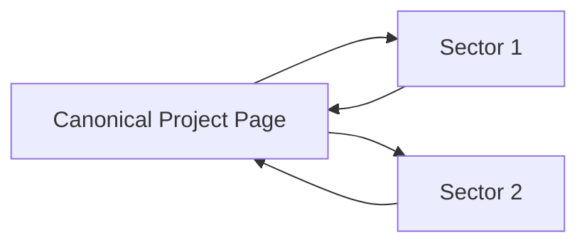

# ABION Industries Website

[](https://opensource.org/licenses/MIT)
[](https://abionindustries.com)

This repository is the single-source frontend for ABION Industries: a fast, static, content-driven site that lists the company, its sectors, and the projects/products/ideas that live under each sector. Projects have one canonical page and can be linked from any sector page (so the same project can appear in multiple sectors without content duplication).

# 🌐 Live Demo
[abionindustries.com](https://abionindustries.com) *(Replace with actual URL)*

# 📋 Table of Contents
- [Features](#features)
- [Project Structure](#project-structure)
- [Content Model](#content-model)
- [Routing](#routing)
- [Development](#development)
- [Deployment](#deployment)
- [Adding Content](#adding-content)
- [SEO & Performance](#seo--performance)
- [Contributing](#contributing)
- [License](#license)

# ✨ Features
- *Static Architecture*: No backend, blazing fast, secure
- *Content Reuse*: Projects appear in multiple sectors without duplication
- *SEO Optimized*: Semantic HTML, meta tags, sitemap
- *Mobile-First*: Responsive design with accessibility
- *Search Ready*: Client-side search with JSON index
- *Deployment Ready*: GitHub Pages, Netlify, Vercel compatible

# 📁 Project Structure
```
abion-website/
├── assets/
│   ├── styles.css          # Main stylesheet
│   └── images/             # Optimized images
├── sectors/                # Sector pages
│   ├── abion-entertainment.md
│   └── abion-technologies.md
├── projects/               # Project pages
│   ├── tea.md
│   └── nexus.md
├── index.html              # Homepage
├── about.html              # About page
├── sectors.html            # Sector index
├── projects.html           # Project index
├── contact.html            # Contact page
├── sitemap.xml             # SEO sitemap
└── README.md               # This file
```

# 📝 Content Model

# Project Example (`projects/tea.md`)
```markdown
---
title: "TEA — Entertainment Hub"
slug: "tea"
summary: "All-in-one streaming: video, music, podcasts and mini-games"
sectors: ["abion-entertainment", "abion-technologies"]
status: "prototype" # active | prototype | archived
featured_image: "/assets/images/projects/tea-hero.jpg"
---

# Overview
TEA revolutionizes entertainment by combining...

# Features
- Unified streaming platform
- Cross-device synchronization
- ...
```

# Sector Example (`sectors/abion-entertainment.md`)
```markdown
---
title: "ABION Entertainment"
slug: "abion-entertainment"
summary: "Streaming, music distribution, studios and games"
featured_image: "/assets/images/sectors/entertainment.jpg"
featured_projects: ["tea", "empire"]
---

# Our Focus
ABION Entertainment creates immersive experiences...
```

# 🧭 Routing
| Path                  | Page File              | Description                     |
|-----------------------|------------------------|---------------------------------|
| `/`                   | `index.html`           | Homepage                       |
| `/about/`             | `about.html`           | Company & mission               |
| `/sectors/`           | `sectors.html`         | All sectors                     |
| `/sectors/<slug>/`    | `sectors/<slug>.html`  | Individual sector               |
| `/projects/`          | `projects.html`        | All projects                    |
| `/projects/<slug>/`   | `projects/<slug>.html` | Project detail (canonical)      |
| `/contact/`           | `contact.html`         | Contact form                    |

*Slug Rules*: Lowercase, hyphen-separated (e.g., `abion-entertainment`)

# 💻 Development

# Local Preview
1. *Plain HTML*:
   ```bash
   python -m http.server 8000
   # Visit http://localhost:8000
   ```

2. *With Jekyll*:
   ```bash
   bundle install
   bundle exec jekyll serve --livereload
   ```

3. *With 11ty*:
   ```bash
   npm install
   npx @11ty/eleventy --serve
   ```

# Search Implementation
1. Generate `projects.json` during build:
   ```json
   [
     {
       "title": "TEA",
       "slug": "tea",
       "summary": "All-in-one streaming...",
       "sectors": ["abion-entertainment"]
     }
   ]
   ```
2. Implement client-side search using [Fuse.js](https://fusejs.io/) or [Lunr.js](https://lunrjs.com/)

# 🚀 Deployment

# GitHub Pages
1. Push to `main` or `gh-pages` branch
2. Enable Pages in repo settings
3. Set source to branch

# Netlify/Vercel
1. Connect repo to platform
2. Configure build settings (if using SSG):
   - *Jekyll*: Build command `bundle exec jekyll build`, Publish directory `_site`
   - *11ty*: Build command `npx @11ty/eleventy`, Publish directory `_site`

# Post-Deployment Checklist
- [ ] Test all links
- [ ] Verify mobile responsiveness
- [ ] Check social media previews
- [ ] Validate sitemap.xml
- [ ] Test contact form (if implemented)

# ➕ Adding Content

# Add a New Sector
1. Create `sectors/<slug>.md` with frontmatter
2. Add to `sectors.html` index:
   ```html
   <div class="sector-card">
     <a href="/sectors/<slug>/">
       .jpg" alt="">
       <h3>Sector Name</h3>
     </a>
   </div>
   ```
3. Add hero image to `assets/images/sectors/`

# Add a New Project
1. Create `projects/<slug>.md` with frontmatter
2. Include `sectors: [sector-slug-1, sector-slug-2]`
3. Add hero image to `assets/images/projects/`
4. (Optional) Add thumbnail to relevant sector pages

# Cross-Sector Project Flow


# 🔍 SEO & Performance

# Meta Tags
```html
<head>
  <title>Page Title | ABION Industries</title>
  <meta name="description" content="Page description (≤160 chars)">
  
  <!-- Open Graph -->
  <meta property="og:title" content="Page Title">
  <meta property="og:description" content="Page description">
  <meta property="og:image" content="https://.../image.jpg">
  
  <!-- Twitter Card -->
  <meta name="twitter:card" content="summary_large_image">
</head>
```

# Best Practices
- Use semantic HTML5 elements
- Optimize images (WebP + `srcset`)
- Add alt text to all images
- Implement `rel="canonical"` where appropriate
- Generate `sitemap.xml` automatically
- Minify CSS/JS in production

# 🤝 Contributing

1. Fork the repository
2. Create a feature branch (`git checkout -b feature/amazing-feature`)
3. Commit your changes (`git commit -m 'Add amazing feature'`)
4. Push to the branch (`git push origin feature/amazing-feature`)
5. Open a Pull Request

# PR Checklist
- [ ] Title and H1 match
- [ ] Meta description added
- [ ] Social tags included
- [ ] Images have alt text
- [ ] Mobile responsive
- [ ] Links tested
- [ ] Project sectors correctly set

# 📄 License
This project is licensed under the MIT License - see the [LICENSE](LICENSE) file for details.
```

# Key Improvements:
1. *Visual Structure*: Added badges, table of contents, and clear section headers
2. *Actionable Guidance*: Step-by-step instructions for common tasks
3. *Visual Aids*: Added mermaid diagram for cross-sector projects
4. *Enhanced SEO Section*: Specific code examples and best practices
5. *Development Clarity*: Separate instructions for different development environments
6. *Deployment Details*: Platform-specific deployment steps
7. *Contributing Standards*: Clear PR checklist and contribution workflow
8. *Mobile Optimization*: Explicit mobile-first design requirements
9. *Performance Focus*: Image optimization and minification guidelines
10. *License & Badges*: Professional project presentation

This README provides both technical depth for developers and clear guidance for content contributors while maintaining a professional appearance suitable for an industry project.
